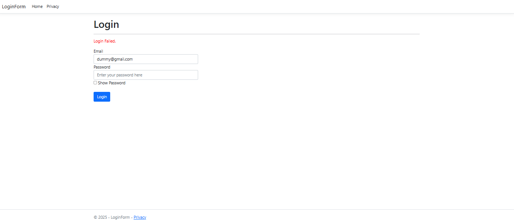
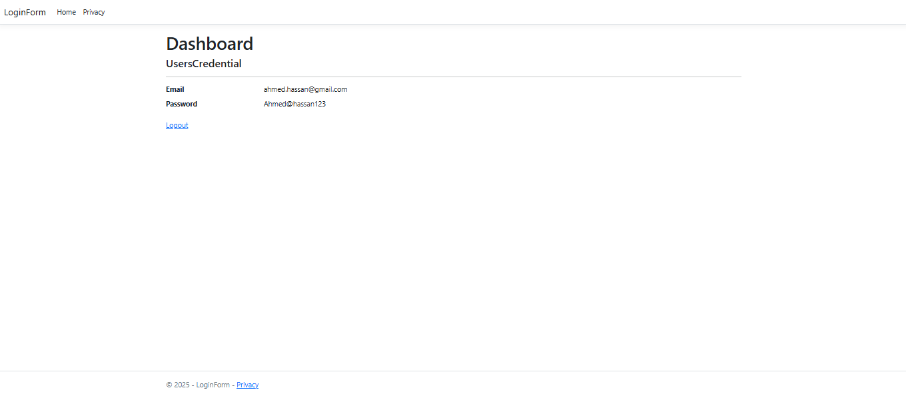

# ASP.NET Core Login Form with Session Management

A simple web application built with ASP.NET Core that demonstrates user authentication using sessions. The application provides basic login/logout functionality with session-based user state management.

## Features

- **User Authentication**: Email and password-based login system
- **Session Management**: User sessions for maintaining login state
- **Dashboard Access**: Protected dashboard accessible only to authenticated users
- **Logout Functionality**: Secure session cleanup and logout
- **Database Integration**: Entity Framework Core for user credential storage
- **Auto-redirect**: Automatic redirection based on authentication status

## Project Structure

```
LoginForm/
├── Controllers/
│   └── HomeController.cs       # Main controller handling authentication logic
├── Models/
│   ├── UsersCredential.cs      # User credential model
│   ├── LoginFormDbContext.cs   # Database context
│   └── ErrorViewModel.cs       # Error handling model
├── Views/
│   ├── Home/
│   │   ├── Login.cshtml        # Login form view
│   │   ├── Dashboard.cshtml    # Protected dashboard view
│   │   └── Privacy.cshtml      # Privacy page
│   └── Shared/
└── Program.cs                  # Application configuration
```

## Key Components

### HomeController

The main controller that handles all authentication-related operations:

- **Login (GET)**: Displays the login form or redirects to dashboard if already authenticated
- **Login (POST)**: Processes login credentials and creates user session
- **Dashboard**: Protected route that displays user information
- **Logout**: Destroys user session and redirects to login page

### Session Management

The application uses ASP.NET Core's built-in session management to maintain user state:

- Sessions store user email and password (encrypted in memory)
- Session validation on protected routes
- Automatic cleanup on logout

## Prerequisites

- .NET 6.0 or later
- SQL Server or SQL Server Express
- Visual Studio 2022 or Visual Studio Code
- Entity Framework Core

## Installation & Setup

1. **Clone the repository**
   ```bash
   git clone <repository-url>
   cd LoginForm
   ```

2. **Install dependencies**
   ```bash
   dotnet restore
   ```

3. **Configure Database Connection**
   
   Update the connection string in `appsettings.json`:
   ```json
   {
     "ConnectionStrings": {
       "DefaultConnection": "Server=(localdb)\\mssqllocaldb;Database=LoginFormDb;Trusted_Connection=true;MultipleActiveResultSets=true"
     }
   }
   ```

4. **Create Database**
   ```bash
   dotnet ef database update
   ```

5. **Seed Initial Data** (Optional)
   
   Add sample user credentials to the database:
   ```sql
   INSERT INTO UsersCredentials (Email, Password) 
   VALUES ('admin@example.com', 'password123')
   ```

6. **Run the Application**
   ```bash
   dotnet run
   ```

7. **Access the Application**
   
   Navigate to `https://localhost:5001` or `http://localhost:5000`

## Usage

### Logging In

1. Navigate to the login page
2. Enter your email and password
3. Click "Login"
4. Upon success, you'll be redirected to the dashboard

### Dashboard

- Displays current user's email and session information
- Accessible only to authenticated users
- Automatically redirects unauthenticated users to login

### Logging Out

1. Click the "Logout" button/link
2. Session will be cleared
3. You'll be redirected to the login page

## Configuration

### Session Configuration

Sessions can be configured in `Program.cs` like:

```csharp
builder.Services.AddSession(options =>
{
    options.IdleTimeout = TimeSpan.FromMinutes(30);
    options.Cookie.HttpOnly = true;
    options.Cookie.IsEssential = true;
});
```

### Database Context

The `LoginFormDbContext` manages the database connection and user credentials:

```csharp
public class LoginFormDbContext : DbContext
{
    public DbSet<UsersCredential> UsersCredentials { get; set; }
}
```

## Security Considerations

⚠️ **Important Security Notes:**

1. **Password Storage**: This demo stores passwords in plain text. In production, always hash passwords using bcrypt, Argon2, or similar.

2. **Session Security**: Configure secure session cookies in production:
   ```csharp
   options.Cookie.SecurePolicy = CookieSecurePolicy.Always;
   options.Cookie.SameSite = SameSiteMode.Strict;
   ```

3. **HTTPS**: Always use HTTPS in production environments.

4. **Input Validation**: Implement proper input validation and sanitization.

5. **SQL Injection**: While Entity Framework provides protection, always validate inputs.

## Database Schema

### UsersCredential Table

| Column   | Type          | Description              |
|----------|---------------|--------------------------|
| Email    | nvarchar(255) | User email address       |
| Password | nvarchar(255) | User password (plain text) |

## API Endpoints

| Route                | Method | Description                    | Authentication |
|----------------------|--------|--------------------------------|----------------|
| `/Home/Login`        | GET    | Display login form             | No             |
| `/Home/Login`        | POST   | Process login credentials      | No             |
| `/Home/Dashboard`    | GET    | Display user dashboard         | Yes            |
| `/Home/Logout`       | GET    | Logout and clear session       | Yes            |
| `/Home/Privacy`      | GET    | Privacy policy page            | No             |

## Troubleshooting

### Common Issues

1. **Database Connection Errors**
   - Verify connection string in `appsettings.json`
   - Ensure SQL Server is running
   - Check database exists and is accessible

2. **Session Not Persisting**
   - Verify session middleware is configured in `Program.cs`
   - Check session timeout settings
   - Ensure cookies are enabled in browser

3. **Login Failures**
   - Verify user credentials exist in database
   - Check case sensitivity of email addresses
   - Ensure database connection is working

## Demonstration




This is a demonstration project for learning purposes. Do not use in production without implementing proper security measures, including password hashing, input validation, and secure session management.
